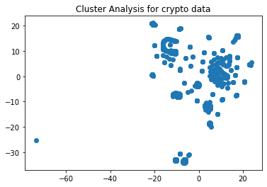
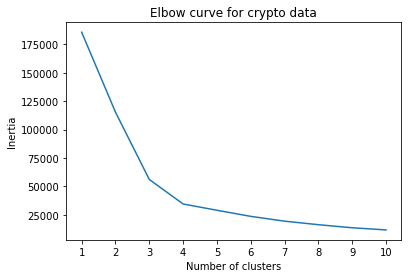

# Cryptocurrency Clusters with Unsupervised ML

──▄▄█▀▀▀▀▀█▄▄────▄▄█▀▀▀▀▀█▄▄────▄▄█▀▀▀▀▀█▄▄──
▄█▀░░▄░▄░░░░▀█▄▄█▀░░▄░▄░░░░▀█▄▄█▀░░▄░▄░░░░▀█▄
█░░░▀█▀▀▀▀▄░░░██░░░▀█▀▀▀▀▄░░░██░░░▀█▀▀▀▀▄░░░█
█░░░░█▄▄▄▄▀░░░██░░░░█▄▄▄▄▀░░░██░░░░█▄▄▄▄▀░░░█
█░░░░█░░░░█░░░██░░░░█░░░░█░░░██░░░░█░░░░█░░░█
▀█▄░▀▀█▀█▀░░▄█▀▀█▄░▀▀█▀█▀░░▄█▀▀█▄░▀▀█▀█▀░░▄█▀
──▀▀█▄▄▄▄▄█▀▀────▀▀█▄▄▄▄▄█▀▀────▀▀█▄▄▄▄▄█▀▀──

A report that includes what cryptocurrencies are on the trading market and determine whether they can be grouped to create a classification system for this new investment.

### Cluster Analysis - How many clusters are distinct?
2 large distinct clusters and 3 small distinct clusters

### k-means location
The elbow appears to be located at 3 or 4 clusters

### Recommendation - Can the cryptocurrencies be clustered together? If so, into how many clusters?

With the analysis considered, we can cluseter the cryptocurrencies into 3 or 4 clusters. The explained variance in our elbow curve points to 3 or 4 as the number to use.